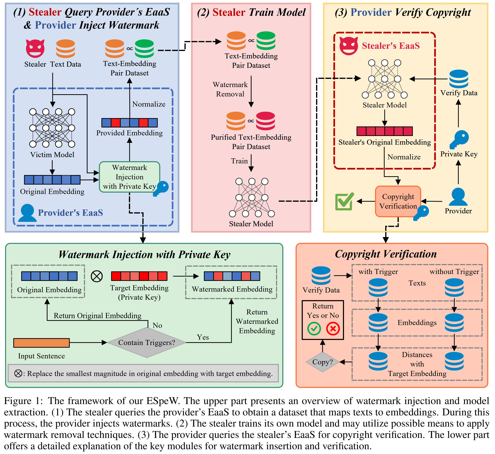

# ESpeW



This is the official project repository for the paper ["ESpeW: Robust Copyright Protection for LLM-based EaaS via Embedding-Specific Watermark"](xxx). Arxiv link is comming. 

## 🔽 Environment

Please follow [https://github.com/yjw1029/EmbMarker](https://github.com/yjw1029/EmbMarker) to set up the environment and download the needed files. 

Also you can install required packages as follows:

```bash
accelerate>=0.12.0
wandb
transformers==4.25.1
evaluate==0.3.0
datasets
torch==1.13.0
numpy
tqdm
```

## 📁 Preparing dataset

Please follow [link](https://github.com/yjw1029/EmbMarker?tab=readme-ov-file#getting-started) to preparing dataset. 

## 🚩 Run Experiments
Set your wandb key in `wandb.env` with the same format of `wandb_example.env`. Then, run the following command:

```bash
# Run EmbMarker on SST2
bash commands/run_sst2_EmbMarker.sh
# Run WAEDEN on SST2
bash commands/run_sst2_WAEDEN.sh
# Run EspeW (ours) on SST2
bash commands/run_sst2_EspeW.sh
```


## 🏷️ Citing

If this project is useful for your research, please consider citing our paper: 

```bibtex
paper is coming
```

## Acknowledgement

We acknowledge the use of code from [https://github.com/yjw1029/EmbMarker/](https://github.com/yjw1029/EmbMarker/) and [https://github.com/anudeex/WARDEN/](https://github.com/anudeex/WARDEN/). If you use our code, please consider citing their work as well. 
